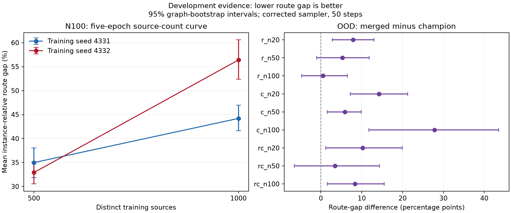

# Corrective experiment results — 2026-09-30

This is execution evidence for [R1-R12](autonomous_work_priority_tasks_2026-09-30.md).
See the [execution status](corrective_execution_2026-09-30.md) for outstanding gates.
All learned-model results below are development diagnostics, not untouched-test claims.

**Established so far.** The reverse transition is now a mixture of normalized hard-state
posteriors. The legacy implementation remains available. Fixing this mathematics does
not recover the paper's F1. Increasing steps to 1,000 also does not recover it.
The six-customer depot counterexample establishes information loss; the matched small
training experiments do not establish a dependable depot-aware performance gain.

Weighted BCE is a clean-target classification surrogate, not an established equivalent
of the paper's variational objective. Removing its positive weight improved calibration
and generated F1 in both small runs, but worsened decoded cost. BatchNorm showed substantial
seed and mode sensitivity; batch-order shuffling did not reliably cure it. These results
do not quantify the corresponding contributions in the full paper-scale model.

The external Figure 8 targets remain 0.823 at 50 steps and 0.875 at 1,000; the paper's
averaging/size mix and exact inference reconstruction remain unresolved. [Paper, Figure 8](https://arxiv.org/pdf/2603.07568v1#page=13).
No new result here establishes paper reproduction or author-code equivalence.

**Why the F1 gap remains.** There is no demonstrated single cause. Historical
maxima mix different measurements: the roughly 0.6695 result was noisy-time
denoising with threshold selection; the roughly 0.6222 robust result was N20-only
generation. Neither is a matched comparison with Figure 8. On the larger shared
development panel, the corrected full checkpoint scores 0.4682 pooled F1 versus
0.5043 when equally averaging the three sizes. Aggregation matters, but that
difference and the sampler correction do not explain a target near 0.823.

The remaining evidence points to model/training reconstruction as an unresolved
problem: customer-only inputs discard depot information, weighted classification
does not ensure calibrated reverse probabilities, and BatchNorm can behave very
differently between training and inference. Small controlled runs show these are
testable concerns, but do not assign a percentage of the full model's deficit to
any one factor. The repaired source curve also does not justify treating more
labels as the established remedy. Exact author metric, input and objective details
remain necessary to separate reconstruction differences from training/data limits.

## Common-panel checkpoint evaluations

Eight graphs per size; shared source-audited development panel, batch 1, float32,
fixed threshold 0.5, graph-ID-derived sampling seeds. F1 is pooled positive-class F1.
Route gap is the mean of instance-relative gaps; ratio-of-total-cost gap is separate.
Timing includes inference and clustering decode, excluding model loading.

| Model / sampler / steps / seed | F1 | Mean gap % | Ratio gap % | Graphs |
|---|---:|---:|---:|---:|
| candidate_n100_posterior_mixture_v2_steps50_seed0 | 0.5241 | 29.24 | 29.50 | 8 |
| candidate_n100_posterior_mixture_v2_steps50_seed1 | 0.5241 | 29.24 | 29.50 | 8 |
| candidate_n20_posterior_mixture_v2_steps50_seed0 | 0.5618 | 24.43 | 24.89 | 8 |
| candidate_n20_posterior_mixture_v2_steps50_seed1 | 0.5635 | 24.43 | 24.89 | 8 |
| candidate_n50_posterior_mixture_v2_steps50_seed0 | 0.5727 | 24.17 | 24.65 | 8 |
| candidate_n50_posterior_mixture_v2_steps50_seed1 | 0.5730 | 24.17 | 24.65 | 8 |
| champion_n100_posterior_mixture_v2_steps50_seed0 | 0.4962 | 33.16 | 32.92 | 8 |
| champion_n100_posterior_mixture_v2_steps50_seed1 | 0.4962 | 33.16 | 32.92 | 8 |
| champion_n20_posterior_mixture_v2_steps50_seed0 | 0.5535 | 26.28 | 26.37 | 8 |
| champion_n20_posterior_mixture_v2_steps50_seed1 | 0.5611 | 27.96 | 28.61 | 8 |
| champion_n50_posterior_mixture_v2_steps50_seed0 | 0.5812 | 29.64 | 30.27 | 8 |
| champion_n50_posterior_mixture_v2_steps50_seed1 | 0.5821 | 30.84 | 31.35 | 8 |
| full_posterior_mixture_v2_steps1000_seed0 | 0.4391 | 46.40 | 45.40 | 24 |
| full_posterior_mixture_v2_steps100_seed0 | 0.4495 | 46.75 | 46.17 | 24 |
| full_posterior_mixture_v2_steps10_seed0 | 0.4884 | 37.54 | 39.11 | 24 |
| full_posterior_mixture_v2_steps50_seed0 | 0.4494 | 44.19 | 44.72 | 24 |
| full_posterior_mixture_v2_steps50_seed1 | 0.4623 | 45.97 | 46.44 | 24 |
| full_skipped_posterior_steps50_seed0 | 0.4373 | 48.10 | 49.59 | 24 |
| full_skipped_posterior_steps50_seed1 | 0.4468 | 47.52 | 49.05 | 24 |
| n20only_posterior_mixture_v2_steps50_seed0 | 0.4847 | 28.70 | 28.69 | 8 |
| n20only_posterior_mixture_v2_steps50_seed1 | 0.4542 | 36.15 | 36.36 | 8 |
| n20only_skipped_posterior_steps50_seed0 | 0.5251 | 28.65 | 29.14 | 8 |
| n20only_skipped_posterior_steps50_seed1 | 0.4909 | 28.46 | 28.40 | 8 |
| pilot_posterior_mixture_v2_steps50_seed0 | 0.4533 | 55.15 | 47.33 | 24 |
| pilot_posterior_mixture_v2_steps50_seed1 | 0.4589 | 51.76 | 45.38 | 24 |
| pilot_skipped_posterior_steps50_seed0 | 0.4565 | 50.61 | 43.66 | 24 |
| pilot_skipped_posterior_steps50_seed1 | 0.4589 | 52.02 | 45.14 | 24 |
| unfiltered_posterior_mixture_v2_steps50_seed0 | 0.4656 | 40.90 | 41.91 | 24 |
| unfiltered_posterior_mixture_v2_steps50_seed1 | 0.4768 | 39.65 | 41.07 | 24 |
| unfiltered_skipped_posterior_steps50_seed0 | 0.4631 | 35.41 | 37.91 | 24 |
| unfiltered_skipped_posterior_steps50_seed1 | 0.4692 | 38.17 | 40.34 | 24 |

## Paired changes

Candidate minus baseline; negative route-gap differences favor the candidate.
Intervals resample graphs within size (10,000 draws); training seeds are not extra graphs.
These intervals are exploratory and do not correct for searching many candidates.

| Comparison | Mean-gap difference, 95% CI (pp) |
|---|---:|
| full_posterior_mixture_v2_steps50_seed0 minus full_skipped_posterior_steps50_seed0 | -3.91 [-9.19, 1.44] |
| full_posterior_mixture_v2_steps50_seed1 minus full_skipped_posterior_steps50_seed1 | -1.55 [-5.17, 2.12] |
| candidate_n20_posterior_mixture_v2_steps50_seed0 minus champion_n20_posterior_mixture_v2_steps50_seed0 | -1.85 [-6.68, 3.90] |
| candidate_n50_posterior_mixture_v2_steps50_seed0 minus champion_n50_posterior_mixture_v2_steps50_seed0 | -5.47 [-9.76, -1.75] |
| candidate_n100_posterior_mixture_v2_steps50_seed0 minus champion_n100_posterior_mixture_v2_steps50_seed0 | -3.92 [-9.22, 1.64] |
| policy_starts16_n100_starts16 minus policy_n100_starts16 | -1.40 [-3.42, 0.60] |
| policy_starts16_seed4332_n100_starts16 minus policy_n100_starts16 | -2.86 [-4.86, -0.89] |
| policy_starts16_seed4333_n100_starts16 minus policy_n100_starts16 | -0.35 [-3.10, 1.93] |

## Expanded development comparison

The panel was fixed before these evaluations: 24 graphs per size (72 total),
including the original eight per size. It is larger development evidence, not an
independent test. Corrected 50-step sampler, seed 0; all other settings unchanged.
Intervals below resample graphs, and do not represent training-seed uncertainty.

| Model | Graphs | Pooled F1, 95% CI | Equal-size F1 | Mean gap %, 95% CI |
|---|---:|---:|---:|---:|
| candidate_n100 | 24 | 0.5450 [0.5301, 0.5612] | 0.5450 | 26.72 [24.23, 29.34] |
| candidate_n20 | 24 | 0.6224 [0.5847, 0.6613] | 0.6224 | 17.57 [13.80, 21.97] |
| candidate_n50 | 24 | 0.5755 [0.5533, 0.5988] | 0.5755 | 25.07 [21.88, 28.49] |
| champion_n100 | 24 | 0.5182 [0.5058, 0.5324] | 0.5182 | 28.51 [25.64, 31.55] |
| champion_n20 | 24 | 0.6230 [0.5845, 0.6626] | 0.6230 | 21.33 [16.60, 25.87] |
| champion_n50 | 24 | 0.5844 [0.5632, 0.6071] | 0.5844 | 29.61 [25.47, 33.51] |
| full | 72 | 0.4682 [0.4517, 0.4856] | 0.5043 | 43.05 [40.33, 45.89] |
| n20only | 24 | 0.5226 [0.4801, 0.5671] | 0.5226 | 31.64 [26.29, 37.02] |
| pilot | 72 | 0.4788 [0.4667, 0.4902] | 0.4919 | 54.06 [48.60, 59.39] |
| unfiltered | 72 | 0.4859 [0.4692, 0.5035] | 0.5127 | 38.07 [35.71, 40.36] |

Paper checkpoints on identical size-specific subsets (24 graphs per cell):

| Checkpoint | Size | F1 | Mean gap % |
|---|---:|---:|---:|
| full | 20 | 0.5421 | 45.74 |
| full | 50 | 0.5293 | 35.33 |
| full | 100 | 0.4416 | 48.08 |
| pilot | 20 | 0.4748 | 89.85 |
| pilot | 50 | 0.5362 | 50.64 |
| pilot | 100 | 0.4648 | 21.70 |
| unfiltered | 20 | 0.5618 | 29.79 |
| unfiltered | 50 | 0.5038 | 40.77 |
| unfiltered | 100 | 0.4725 | 43.66 |
| n20only | 20 | 0.5226 | 31.64 |

| Task 5 candidate minus champion | F1 difference, 95% CI | Mean-gap difference, 95% CI (pp) |
|---|---:|---:|
| N20 | -0.0006 [-0.0156, 0.0148] | -3.75 [-8.26, 0.39] |
| N50 | -0.0090 [-0.0139, -0.0043] | -4.54 [-7.41, -1.92] |
| N100 | 0.0269 [0.0203, 0.0335] | -1.80 [-4.76, 1.13] |

## Learning, depot, objective and normalization diagnostics

One-source sanity: 1,200 updates; other arms: 32 sources per size, 600 updates,
two seeds, width 64, three denoiser/GAT layers, jointly trained GAT, no augmentation.
Final-update checkpoints, with identical split/budget within matched pairs. This is a
reduced-scale diagnostic, not a recreation of frozen-GAT paper training. Train metrics
in the raw summaries use the first eight training examples (N20); validation pools all sizes.

| Arm / training seed | Generated validation F1 | Mean route gap % | High-noise calibration error |
|---|---:|---:|---:|
| baseline_seed4331 | 0.4029 | 34.72 | 0.1842 |
| baseline_seed4332 | 0.3923 | 30.09 | 0.1768 |
| bn_shuffled_seed4331 | 0.2022 | 36.23 | 0.8358 |
| bn_shuffled_seed4332 | 0.3563 | 100.30 | 0.0939 |
| bn_sorted_seed4331 | 0.3695 | 20.91 | 0.2070 |
| bn_sorted_seed4332 | 0.2245 | 201.62 | 0.2236 |
| depot_seed4331 | 0.3777 | 24.93 | 0.2436 |
| depot_seed4332 | 0.3999 | 30.37 | 0.2378 |
| tiny_seed4331 | 0.5098 | 32.78 | 0.2746 |
| unweighted_seed4331 | 0.4349 | 55.23 | 0.0081 |
| unweighted_seed4332 | 0.4681 | 46.96 | 0.0098 |

The tiny run reached generated training F1=1.0 and exact oracle reconstruction at
1, 50 and 1,000 steps. This validates basic fit/endpoints, not generalization.

Single-size N100 normalization controls use the same 32 N100 sources, eight
development graphs, two seeds and 600 updates; they isolate normalization within
one size rather than conflating it with traversal of mixed-size batches.

| N100-only arm / seed | Generated F1 | Mean route gap % |
|---|---:|---:|
| baseline_seed4331 | 0.4155 | 31.68 |
| baseline_seed4332 | 0.3964 | 33.79 |
| bn_shuffled_seed4331 | 0.4046 | 26.73 |
| bn_shuffled_seed4332 | 0.4207 | 30.78 |

Additional graph-level rescoring uses seed 9001 derived from graph IDs, unlike
the position-derived seeds in the original small-run summaries above. The paired
effects below compare arms within this additional common protocol. They remain
exploratory development evidence; eight graphs per size cannot settle full-scale effects.

| Variant minus matched LayerNorm baseline / seed | F1 difference, 95% CI | Mean-gap difference, 95% CI (pp) |
|---|---:|---:|
| mixed_depot_seed4331 | -0.0240 [-0.0276, -0.0205] | -7.39 [-10.21, -4.57] |
| mixed_depot_seed4332 | 0.0081 [0.0055, 0.0110] | 1.00 [-1.77, 3.73] |
| mixed_unweighted_seed4331 | 0.0306 [0.0212, 0.0397] | 15.77 [11.88, 19.66] |
| mixed_unweighted_seed4332 | 0.0842 [0.0752, 0.0941] | 17.90 [12.84, 22.91] |
| mixed_bn_sorted_seed4331 | -0.0325 [-0.0433, -0.0215] | -13.29 [-16.41, -9.87] |
| mixed_bn_sorted_seed4332 | -0.1656 [-0.1765, -0.1548] | 170.29 [159.27, 181.64] |
| mixed_bn_shuffled_seed4331 | -0.1980 [-0.2046, -0.1916] | 1.59 [-1.80, 5.31] |
| mixed_bn_shuffled_seed4332 | -0.0264 [-0.0389, -0.0131] | 67.32 [54.14, 80.42] |
| single_bn_shuffled_seed4331 | -0.0094 [-0.0148, -0.0031] | -4.12 [-8.09, -0.65] |
| single_bn_shuffled_seed4332 | 0.0233 [0.0162, 0.0303] | 1.21 [-4.08, 5.77] |

`bn_sorted` versus the shuffled LayerNorm baseline changes both normalization and
order. The direct BatchNorm-only order contrast below isolates batch traversal.

| Shuffled minus sorted BatchNorm / seed | F1 difference, 95% CI | Mean-gap difference, 95% CI (pp) |
|---|---:|---:|
| 4331 | -0.1655 [-0.1775, -0.1530] | 14.88 [11.47, 18.78] |
| 4332 | 0.1392 [0.1275, 0.1505] | -102.97 [-113.78, -92.28] |

The N100-only controls are more stable and their original route-gap point estimates
favor BatchNorm in both seeds. The graph-ID-seeded rescoring reverses that direction
for seed 4332, so the route gain is not dependable across sampling protocols.
The improved stability supports investigating size interactions, but
does not prove that ordering alone explains the full-model deficit: single-size
training also changes exposure per size under the fixed total update budget.
No normalization replacement is selected from these small diagnostics.

The 48-case CPU clone probe covers four BatchNorm checkpoints, three sizes and
four noise levels. Mean absolute train/eval probability differences reach 0.754
at batch size 1. The original parameters and buffers remain exactly unchanged.
This shows a mode mismatch in these diagnostics, not its share of the paper F1 gap.

## Held-out post-hoc calibration

Fit a size-specific logit intercept on 24 separate calibration graphs, excluding
both the 24-graph diagnostic panel and the expanded 72-graph panel. The fit minimized
unweighted BCE across four fixed noise levels. This is an empirical calibration test,
not an assertion that one offset exactly undoes varying per-batch class weights.

| Sampling seed | Shift inside reverse chain: F1 | Mean route gap % | Final-classification-only F1 |
|---|---:|---:|---:|
| 0 | 0.4067 | 88.19 | 0.4493 |
| 1 | 0.3974 | 89.84 | 0.4599 |

| Seed | Inside-chain shift F1 difference, 95% CI | Mean-gap difference, 95% CI (pp) |
|---|---:|---:|
| 0 | -0.0428 [-0.0630, -0.0234] | 44.00 [37.79, 51.11] |
| 1 | -0.0649 [-0.0823, -0.0455] | 43.87 [36.53, 51.16] |

Reject this particular calibration recipe: it worsened generation and route utility.

## Identical-panel classical and policy comparison

PyVRP/OR-Tools receive 1 or 3 seconds of search time per instance; actual elapsed
runtime includes solver setup. All 24 graphs are held out of the compared training sets.
Policy rows without `_e2e` isolate decoding using the exact cached champion prior
(corrected sampler, 50 steps, seed 0), and their timing excludes prior generation.
Rows with `_e2e` regenerate the prior and include it in timing. Model loading is excluded.
The hardware differs (GPU learned methods versus CPU solvers); this is a measured
quality/time comparison, not a claim of identical compute resources.
`matched_policy16` solver rows cap search at each graph's measured K=16 policy
end-to-end time. Solver setup is extra; actual elapsed is also recorded. All
same-size comparisons below use exactly the same graph IDs and reference costs.

| Method | Graphs | Mean gap % | Ratio gap % | Mean elapsed seconds | Feasible fraction |
|---|---:|---:|---:|---:|---:|
| ortools_matched_policy16 | 24 | 4.77 | 5.72 | 1.263 | 1.000 |
| ortools_seconds1 | 24 | 5.04 | 5.98 | 1.019 | 1.000 |
| ortools_seconds3 | 24 | 4.39 | 5.28 | 3.017 | 1.000 |
| policy_n100_starts1 | 8 | 32.02 | 31.96 | 0.383 | 1.000 |
| policy_n100_starts16 | 8 | 25.65 | 25.54 | 0.409 | 1.000 |
| policy_n100_starts16_e2e | 8 | 25.65 | 25.54 | 1.453 | 1.000 |
| policy_n100_starts1_e2e | 8 | 32.02 | 31.96 | 1.454 | 1.000 |
| policy_n100_starts8 | 8 | 26.73 | 26.60 | 0.436 | 1.000 |
| policy_n100_starts8_e2e | 8 | 26.73 | 26.60 | 1.396 | 1.000 |
| policy_n20_starts1 | 8 | 13.68 | 13.88 | 0.126 | 1.000 |
| policy_n20_starts16 | 8 | 7.97 | 8.06 | 0.125 | 1.000 |
| policy_n20_starts16_e2e | 8 | 7.97 | 8.06 | 1.055 | 1.000 |
| policy_n20_starts1_e2e | 8 | 13.68 | 13.88 | 1.134 | 1.000 |
| policy_n20_starts8 | 8 | 9.91 | 10.01 | 0.126 | 1.000 |
| policy_n20_starts8_e2e | 8 | 9.91 | 10.01 | 1.023 | 1.000 |
| policy_n50_starts1 | 8 | 29.41 | 29.31 | 0.254 | 1.000 |
| policy_n50_starts16 | 8 | 19.30 | 19.19 | 0.193 | 1.000 |
| policy_n50_starts16_e2e | 8 | 19.30 | 19.19 | 1.210 | 1.000 |
| policy_n50_starts1_e2e | 8 | 29.41 | 29.31 | 1.249 | 1.000 |
| policy_n50_starts8 | 8 | 21.79 | 21.66 | 0.209 | 1.000 |
| policy_n50_starts8_e2e | 8 | 21.79 | 21.66 | 1.137 | 1.000 |
| policy_starts16_n100_starts1 | 8 | 29.61 | 29.34 | 0.496 | 1.000 |
| policy_starts16_n100_starts16 | 8 | 24.25 | 24.12 | 0.492 | 1.000 |
| policy_starts16_n100_starts8 | 8 | 24.90 | 24.73 | 0.444 | 1.000 |
| policy_starts16_seed4332_n100_starts1 | 8 | 29.25 | 29.12 | 0.435 | 1.000 |
| policy_starts16_seed4332_n100_starts16 | 8 | 22.79 | 22.73 | 0.442 | 1.000 |
| policy_starts16_seed4332_n100_starts8 | 8 | 23.53 | 23.42 | 0.517 | 1.000 |
| policy_starts16_seed4333_n100_starts1 | 8 | 29.99 | 29.88 | 0.370 | 1.000 |
| policy_starts16_seed4333_n100_starts16 | 8 | 25.30 | 25.33 | 0.354 | 1.000 |
| policy_starts16_seed4333_n100_starts8 | 8 | 26.43 | 26.38 | 0.347 | 1.000 |
| pyvrp_matched_policy16 | 24 | 0.36 | 0.50 | 1.269 | 1.000 |
| pyvrp_seconds1 | 24 | 0.57 | 0.79 | 1.035 | 1.000 |
| pyvrp_seconds3 | 24 | 0.28 | 0.39 | 3.027 | 1.000 |

| Size | Method | Mean gap % | Ratio gap % | Mean elapsed seconds |
|---|---|---:|---:|---:|
| 20 | champion_n20_posterior_mixture_v2_steps50_seed0 | 26.28 | 26.37 | 1.051 |
| 20 | policy_n20_starts16_e2e | 7.97 | 8.06 | 1.055 |
| 20 | pyvrp_seconds1 | 0.00 | 0.00 | 1.009 |
| 20 | pyvrp_seconds3 | 0.00 | 0.00 | 3.005 |
| 20 | ortools_seconds1 | 1.02 | 1.07 | 1.014 |
| 20 | ortools_seconds3 | 0.73 | 0.78 | 3.003 |
| 20 | pyvrp_matched_policy16 | 0.00 | 0.00 | 1.059 |
| 20 | ortools_matched_policy16 | 1.02 | 1.07 | 1.082 |
| 50 | champion_n50_posterior_mixture_v2_steps50_seed0 | 29.64 | 30.27 | 1.143 |
| 50 | policy_n50_starts16_e2e | 19.30 | 19.19 | 1.210 |
| 50 | pyvrp_seconds1 | 0.19 | 0.19 | 1.019 |
| 50 | pyvrp_seconds3 | 0.10 | 0.10 | 3.015 |
| 50 | ortools_seconds1 | 5.63 | 5.51 | 1.012 |
| 50 | ortools_seconds3 | 4.67 | 4.52 | 3.014 |
| 50 | pyvrp_matched_policy16 | 0.19 | 0.19 | 1.224 |
| 50 | ortools_matched_policy16 | 4.85 | 4.71 | 1.220 |
| 100 | champion_n100_posterior_mixture_v2_steps50_seed0 | 33.16 | 32.92 | 2.274 |
| 100 | policy_n100_starts16_e2e | 25.65 | 25.54 | 1.453 |
| 100 | pyvrp_seconds1 | 1.51 | 1.52 | 1.075 |
| 100 | pyvrp_seconds3 | 0.73 | 0.75 | 3.062 |
| 100 | ortools_seconds1 | 8.47 | 8.42 | 1.031 |
| 100 | ortools_seconds3 | 7.78 | 7.72 | 3.034 |
| 100 | pyvrp_matched_policy16 | 0.90 | 0.92 | 1.524 |
| 100 | ortools_matched_policy16 | 8.44 | 8.38 | 1.488 |

## CVRPLIB expansion and additional defect

The existing evaluator ignored the declared fleet count. The first expanded run
returned B-n51-k7 cost 1,016 with eight vehicles against a seven-vehicle reference of
1,032. That comparison is invalid. The corrected evaluator caps the declared fleet;
the superseded run is retained only as diagnostic evidence.

Corrected PyVRP runs use a 3-second search limit, seed 42 with per-instance derivation,
and integer `EUC_2D` nearest rounding. Reference solutions come from the
[official CVRPLIB index](https://galgos.inf.puc-rio.br/cvrplib/index.php/en/instances/1).
B-n51-k7's solution download was unavailable; its reference is the instance comment,
cross-checked against the index. Other references use the downloaded `.sol` costs.

| Instance | Vehicles used / cap | Cost | Reference | Gap % |
|---|---:|---:|---:|---:|
| A-n32-k5 | 5 / 5 | 784.0 | 784.0 | 0.000 |
| A-n53-k7 | 7 / 7 | 1017.0 | 1010.0 | 0.693 |
| B-n51-k7 | 7 / 7 | 1032.0 | 1032.0 | 0.000 |
| E-n101-k8 | 8 / 8 | 818.0 | 815.0 | 0.368 |
| E-n51-k5 | 5 / 5 | 521.0 | 521.0 | 0.000 |
| P-n21-k2 | 2 / 2 | 211.0 | 211.0 | 0.000 |

## R/C/RC breakdown

Eight randomly selected stable-label graphs per cell, seed 93829; corrected sampler,
50 steps, sampling seed 0. Coverage shows accepted labels out of the original
1,000 graphs per cell. Conclusions apply to these checkpoints and selected labels.

| Cell | Stable-label coverage | Champion F1 | Merged F1 | Champion gap % | Merged gap % | Paired gap difference, 95% CI |
|---|---:|---:|---:|---:|---:|---:|
| r_n20 | 985/1000 | 0.6675 | 0.5965 | 17.01 | 24.92 | 7.91 [2.82, 13.02] |
| r_n50 | 824/1000 | 0.5686 | 0.5222 | 27.54 | 32.84 | 5.30 [-1.03, 11.84] |
| r_n100 | 519/1000 | 0.5253 | 0.5430 | 32.76 | 33.30 | 0.54 [-4.72, 6.47] |
| c_n20 | 976/1000 | 0.6126 | 0.6084 | 17.35 | 31.57 | 14.23 [7.20, 21.25] |
| c_n50 | 941/1000 | 0.5510 | 0.5407 | 19.83 | 25.70 | 5.87 [1.57, 9.90] |
| c_n100 | 704/1000 | 0.4082 | 0.4913 | 26.34 | 54.17 | 27.82 [11.78, 43.56] |
| rc_n20 | 991/1000 | 0.5824 | 0.4964 | 18.67 | 28.92 | 10.24 [1.22, 19.92] |
| rc_n50 | 839/1000 | 0.5752 | 0.5539 | 30.19 | 33.65 | 3.47 [-6.49, 14.34] |
| rc_n100 | 482/1000 | 0.4932 | 0.5548 | 30.33 | 38.65 | 8.32 [1.60, 15.53] |

| Cell | Champion F1, 95% CI | Merged F1, 95% CI | Champion / merged feasible |
|---|---:|---:|---:|
| r_n20 | 0.6675 [0.6123, 0.7338] | 0.5965 [0.5072, 0.6833] | 1.000 / 1.000 |
| r_n50 | 0.5686 [0.5346, 0.6052] | 0.5222 [0.4904, 0.5494] | 1.000 / 1.000 |
| r_n100 | 0.5253 [0.5037, 0.5468] | 0.5430 [0.5100, 0.5729] | 1.000 / 1.000 |
| c_n20 | 0.6126 [0.5514, 0.6715] | 0.6084 [0.5502, 0.6702] | 1.000 / 1.000 |
| c_n50 | 0.5510 [0.5033, 0.6085] | 0.5407 [0.5050, 0.5899] | 1.000 / 1.000 |
| c_n100 | 0.4082 [0.3584, 0.4735] | 0.4913 [0.4636, 0.5164] | 1.000 / 1.000 |
| rc_n20 | 0.5824 [0.5470, 0.6245] | 0.4964 [0.4326, 0.5673] | 1.000 / 1.000 |
| rc_n50 | 0.5752 [0.5422, 0.6071] | 0.5539 [0.5101, 0.5998] | 1.000 / 1.000 |
| rc_n100 | 0.4932 [0.4503, 0.5360] | 0.5548 [0.5209, 0.5914] | 1.000 / 1.000 |

## Source-count curve decision

Four runs under the [predeclared five-epoch protocol](corrective_curve_protocol_2026-09-30.md).

| Training seed | 1,000 minus 500 source mean-gap difference, 95% CI | Passes rule |
|---|---:|---|
| 4331 | 9.22 [5.59, 12.84] | False |
| 4332 | 23.48 [19.13, 27.84] | False |

stop this bounded curve; no independently justified finalist; preserve reserved test

| Sources / seed | F1 | Mean gap % | Optimizer steps | Recorded loop seconds |
|---|---:|---:|---:|---:|
| 500 / 4331 | 0.5567 | 34.97 | 160 | 44.81 |
| 500 / 4332 | 0.5533 | 32.90 | 160 | 43.02 |
| 1000 / 4331 | 0.4392 | 44.19 | 315 | 77.20 |
| 1000 / 4332 | 0.4438 | 56.38 | 315 | 77.00 |

Recorded loop time includes training and noisy validation through the final epoch,
but excludes the final full-chain validation and subsequent standalone rescoring.
Fixed epochs give the larger source pool more updates. The reversal is specific
to this five-epoch recipe; it does not prove that more data generally harms learning.

Direct seed checks found no exactly identical probability arrays across seeds.
Some hard matrices were identical. Equal aggregate F1/gap therefore does not
establish identical outputs; the archive records counts for each checkpoint.

## Remaining interpretation limits

The 96 reserved test sources remain unscored. Their original references are not yet
a strong final benchmark. No development comparison alone freezes a new champion.
The classical/paper freeze and downstream quantum prerequisites remain unsatisfied.
The [candidate manifest](evidence/corrective_20260930/candidate_baseline.json) records
the defer-freeze decision, checkpoint identities and unresolved author assumptions.
Raw outputs contain checkpoint/panel hashes, graph predictions and both gap definitions.
This report includes only completed artifacts; absent tables are pending, not negative results.
