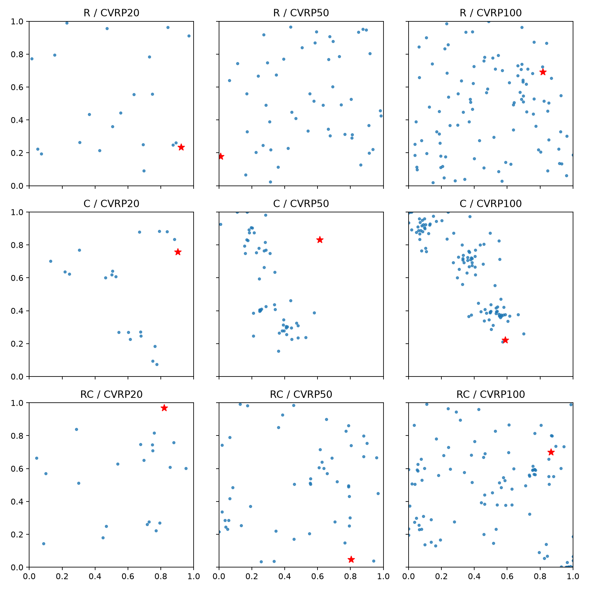

# Plain-CVRP spatial stress validation

The R/C/RC labels describe customer-coordinate regimes only; these are not Solomon CVRPTW
instances. Metrics cover all 1,000 instances per size and regime. Best-K K-means silhouette uses a
fixed 50-instance prefix per cell because it is substantially more expensive.

| Regime | Size | Nearest neighbor | Pair distance | Grid entropy | Best-K silhouette |
|---|---:|---:|---:|---:|---:|
| R | 20 | 0.1249 | 0.5232 | 0.6236 | 0.4911 |
| RC | 20 | 0.1075 | 0.5085 | 0.5979 | 0.5480 |
| C | 20 | 0.0550 | 0.4398 | 0.5160 | 0.7169 |
| R | 50 | 0.0751 | 0.5229 | 0.7821 | 0.4625 |
| RC | 50 | 0.0655 | 0.5039 | 0.7296 | 0.5313 |
| C | 50 | 0.0377 | 0.4421 | 0.6146 | 0.6938 |
| R | 100 | 0.0522 | 0.5210 | 0.8769 | 0.4336 |
| RC | 100 | 0.0467 | 0.5046 | 0.8080 | 0.5175 |
| C | 100 | 0.0283 | 0.4434 | 0.6610 | 0.6659 |

Every size shows the intended ordering: C has the smallest nearest-neighbor distance, pair
distance, and occupied-grid entropy, with RC between C and R. C also has the strongest cluster
silhouette and RC again lies between C and R. The regime names are therefore empirically separated
under complementary local, global-dispersion, occupancy, and cluster metrics.

Frozen directory hashes from the current generator/configuration are:

- R: `d01f088205cbba5491ccd9ca66fbfaeaee8e6c37f1e28cf9fd0ca7dcf1af2f96`
- C: `f21692b81b933e66abc364d752aeabb9c09544f4ea24fdfa5db41977d24e7f30`
- RC: `67c2d07824b999b7415bb12b4051a55081170a3fc2fc69cb270ae386ca71df9b`

The machine-readable evidence is in
[`assets/spatial_stress_validation/spatial_metrics.json`](assets/spatial_stress_validation/spatial_metrics.json),
with the same rows in CSV. Representative median-nearest-neighbor instances are shown below.

An exact content-hash comparison against all 200,001 instances in the existing `s7799` corpus
found zero overlaps with the 3,000 independent R instances (zero separately for CVRP20/50/100).
The audit excludes generator metadata and hashes the capacity, ordered coordinates, and demands;
see
[`assets/spatial_stress_validation/r_vs_training_overlap.json`](assets/spatial_stress_validation/r_vs_training_overlap.json).

